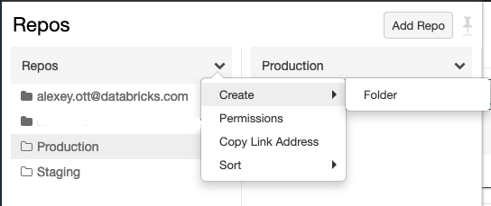
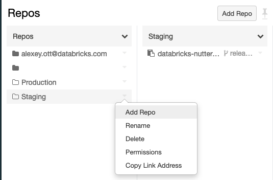

This repository contains notebooks & instructions for setting up the demo of development workflow & CI/CD (on Azure DevOps) using the Databricks notebooks and [Projects feature](https://docs.databricks.com/projects.html).  

This demo shows how you can use Projects to work on your own copy of notebooks, test them after commit in the "staging" environment, and promote to "production" on successful testing of `releases` branch.

# Setup on Databricks side

Your Databricks workspace needs to have Project functionality enabled.  If it's enabled

* Fork repository into your environment - Github, or Azure DevOps (follow Databricks documentation on setting
* In the Projects, click "Create Project" and link it to the Git repository that you've forked - this will be your personal copy of the code that will be used for work:

* Create the staging & production checkouts
  * In the Projects, in the top-level part, click on the "ᐯ" near the "Projects" header, select "Create" and select "Folder" (see image).  Give it the name "Staging":

  * Click on the  "ᐯ" near the "Staging" folder, and click "Create" and select "Project":

  * Link it to the Git repository, similarly how you did it for your personal checkout 
  * Create the "Production" folder with project inside, repeating two previous steps
* Create a new cluster that will be used for execution of the tests, you will need to pass the [cluster ID](https://docs.databricks.com/workspace/workspace-details.html#cluster-url-and-id) to the Nutter to execute the tests
* Create a [personal access token (PAT)](https://docs.databricks.com/administration-guide/access-control/tokens.html) that will be used for execution of the tests & updating the projects

# Setup Azure DevOps

# Details

Testing of notebooks is done using the [Nutter library](https://github.com/microsoft/nutter) developed by Microsoft.  The "main" code is in the notebooks `Code1.py` and `Code2.py`, and the testing code is in the `test_code1_code2.py`.

